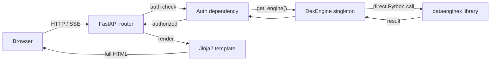
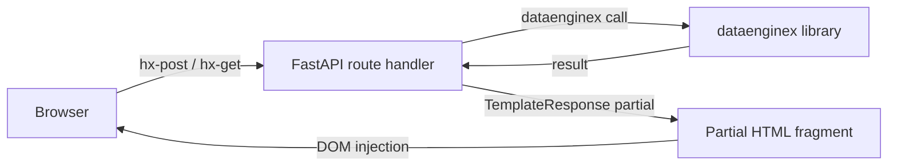
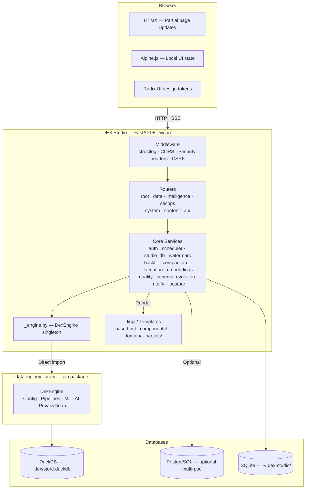
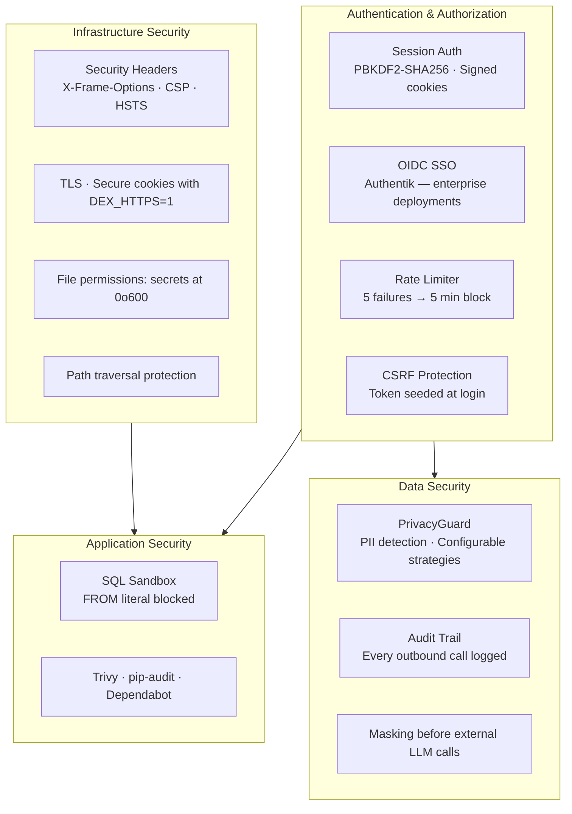

# DEX Studio — Architecture Reference

Stack: Python 3.13+ · FastAPI · Jinja2 · HTMX · Alpine.js · structlog · port 7860

## How a request flows

Every page load follows the same path — one process, no hops:

For HTMX partial updates, it skips the full page render — the route returns an HTML fragment that HTMX injects into the DOM:

HTMX handles server round-trips. Alpine.js is used only for local UI state (dropdowns, toggles) that requires no server call.

## Container Architecture

## Auth

- `POST /login` — validates submitted password via PBKDF2-SHA256 against `~/.dex-studio/auth.hash`
- On success: `session["authenticated"] = True` written into a signed session cookie (`dex_session`)
- Password is set on first boot via `GET /setup`; rate limiter blocks 5 failed attempts for 5 minutes per IP
- All routes call `auth_required(request)` at the top of the handler; unauthenticated requests are redirected to `/login` (303)
- Session cookie is signed by a secret stored at `~/.dex-studio/session.key` (auto-generated on first boot)
- `DEX_HTTPS=1` sets `https_only=True` on the `SessionMiddleware`

### Security Architecture

## Engine Singleton

`src/dex_studio/_engine.py` holds one `DexEngine` instance for the process lifetime.

- `get_engine()` — returns the singleton, auto-initializing from `DEX_CONFIG_PATH` or the saved default project path
- `init_engine(config_path)` — closes the previous engine (releases DuckDB handles), then constructs a new one; guarded by a `threading.Lock`
- `DexEngine` is imported directly from `dataenginex.engine` — no HTTP, no port 17000

## Routers

`create_app()` in `app.py` registers seven routers:

| Router | Prefix |
| -------- | --------- |
| `root` | `/` |
| `data` | `/data` |
| `intelligence` | `/intelligence` |
| `secops` | `/secops` |
| `system` | `/system` |
| `content` | `/content` |
| `api` | `/api` |

Navigation is driven by `src/dex_studio/nav.py` with two-rail sidebar layout (nav groups: Data, Pipelines, Intelligence, Platform, System).

Shared FastAPI dependencies (engine, auth, template handle) live in `src/dex_studio/routers/_deps.py`.

## Template System

- All page templates: ``, override ``
- Templates directory: `src/dex_studio/templates/`
- Jinja2 environment registered with custom filters: `fmt_ts`, `fmt_cron`, `fmt_bytes`, `status_color`
- Template singleton attached to `app.state.templates` at startup

## Static Assets

Served from `src/dex_studio/static/` at `/static/`.

## Projects Registry

`src/dex_studio/config.py` manages two files:

- `~/.dex-studio/projects.yaml` — list of `{name, config_path}` entries
- `~/.dex-studio/prefs.yaml` — UI preferences (theme, window size)

Project switching at runtime calls `init_engine(new_path)` which safely tears down and rebuilds the singleton.

## Persistence Layer (StudioDb)

`src/dex_studio/studio_db.py` provides dual-backend persistent storage for scheduler state, pipeline locks, run history, watermarks, schema contracts, AI traces, and embeddings.

| Backend | When | Class |
| --- | --- | --- |
| SQLite (WAL, thread-local connections) | `DATABASE_URL` not set — single-pod default | `StudioDb` |
| PostgreSQL (SQLAlchemy pool + `pg_advisory_lock`) | `DATABASE_URL` set — multi-pod / production | `PgStudioDb` |

`get_studio_db(eng)` returns the process-level singleton, creating it on first call. Both backends expose the same interface.

Pipeline mutual exclusion: `pipeline_locks` table — SQLite uses `INSERT OR FAIL`; Postgres uses `pg_try_advisory_lock` (session-scoped, held on a dedicated connection until `release_lock`). Scheduler leader election uses the same mechanism (SQLite always returns `True`).

## Data Pipeline Architecture

```mermaid
flowchart LR
    subgraph SOURCES["Source Systems"]
        CSV["CSV · Parquet · JSON"]
        PG_DB[("PostgreSQL")]
        KAFKA[("Kafka / Redpanda")]
        RABBIT[("RabbitMQ")]
        REST_API[("REST · GraphQL APIs")]
        CLOUD_SRC[("S3 · GCS · BigQuery")]
        SPARK_SRC[("PySpark · dbt CLI")]
        ES_SRC[("Elasticsearch")]
    end

    subgraph CONNECTOR["Connector Layer"]
        C["BaseConnector ABC"]
        C_CSV["CsvConnector"]
        C_PG["PostgresConnector"]
        C_KAFKA["KafkaConnector"]
        C_RABBIT["RabbitMQConnector"]
        C_REST["HttpConnector"]
        C_CLOUD["CloudConnector"]
        C_SPARK["SparkConnector"]
        C_ES["ElasticsearchConnector"]
    end

    subgraph PIPELINE["Pipeline Engine"]
        DAG["DAG: croniter · depends-on"]
        RUN["Runner: source → transform → destination"]
        Q["Quality: profiler · validation · thresholds"]
        W["Watermark: dedup · idempotency"]
    end

    subgraph WH["Warehouse — Medallion"]
        BRONZE["Bronze — raw"]
        SILVER["Silver — cleaned"]
        GOLD["Gold — aggregated"]
        CAT["Catalog · Lineage"]
    end

    SOURCES --> CONNECTOR
    CONNECTOR --> PIPELINE
    PIPELINE --> WH
```

## Scheduler

`src/dex_studio/scheduler.py` runs as an asyncio task alongside FastAPI.

- Root pipelines (no `depends_on`) fire when their cron expression is due (`croniter`).
- On success, `set_last_run()` is written to `StudioDb` and dependents are triggered recursively.
- Manual runs via `jobs.py` also call `set_last_run()` on success so cron computes the correct next-fire time.
- Failed pipelines retry up to `retry.max_attempts` (default 2) with exponential backoff, then move to dead letter.
- Adaptive tick: sleeps until the next cron fires (capped at 30 s) rather than a fixed interval.

## Deployment

DEX Studio ships as a Docker image and runs on Kubernetes via ArgoCD from [infradex](https://github.com/TheDataEngineX/infradex). Run locally with `docker compose up`.

## Technology Stack

| Category | Technology | Purpose |
|----------|-----------|---------|
| **Runtime** | Python 3.13+ | Application runtime |
| **Web Framework** | FastAPI + Uvicorn | ASGI server |
| **Templating** | Jinja2 | Server-rendered HTML |
| **Frontend** | HTMX + Alpine.js | Dynamic UI, no JS build |
| **Styling** | Custom CSS + Radix tokens | Design system |
| **Engine** | dataenginex (PyPI) | Data · ML · AI · PrivacyGuard |
| **Persistence** | DuckDB | Embedded project store |
| **State (single-pod)** | SQLite | Scheduler state, locks |
| **State (multi-pod)** | PostgreSQL | Scheduler state, locks |
| **Vector Store** | Qdrant / DuckDB VSS | Embedding search |
| **LLM (local)** | Ollama | Default LLM provider |
| **LLM (remote)** | OpenAI / Anthropic | Opt-in LLM providers |
| **Streaming** | Kafka / Redpanda | Event streams |
| **Messaging** | RabbitMQ | Message queues |
| **Search** | Elasticsearch | Full-text search |
| **Job Queue** | ARQ + Redis | Background tasks |
| **ML Training** | scikit-learn, XGBoost, PyTorch | Model training |
| **ML Tracking** | MLflow | Experiment tracking |
| **Compute** | PySpark | Distributed processing |
| **Transform** | dbt CLI | SQL transform management |
| **Cloud Storage** | S3, GCS, BigQuery | Remote data access |
| **Auth** | Authentik OIDC | SSO integration |
| **Logging** | structlog | Structured logging |
| **Metrics** | Prometheus client | Application metrics |
| **Tracing** | OpenTelemetry | Distributed tracing |
| **CI/CD** | GitHub Actions | Lint, test, build, release |
| **Container** | Docker | Application packaging |
| **Orchestration** | Kubernetes + ArgoCD | Production deployment |
| **Build** | Hatchling + uv | Python build system |
| **Quality** | Ruff + mypy strict + pytest | Lint, types, tests |
