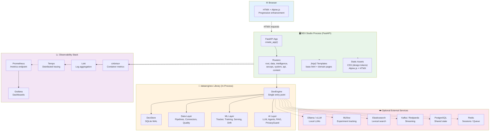
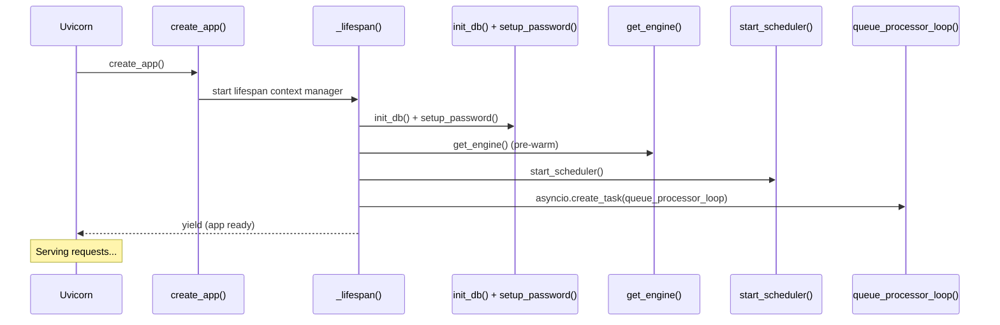
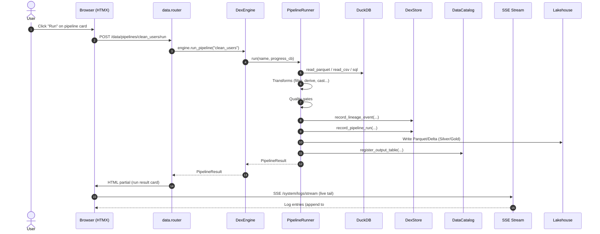
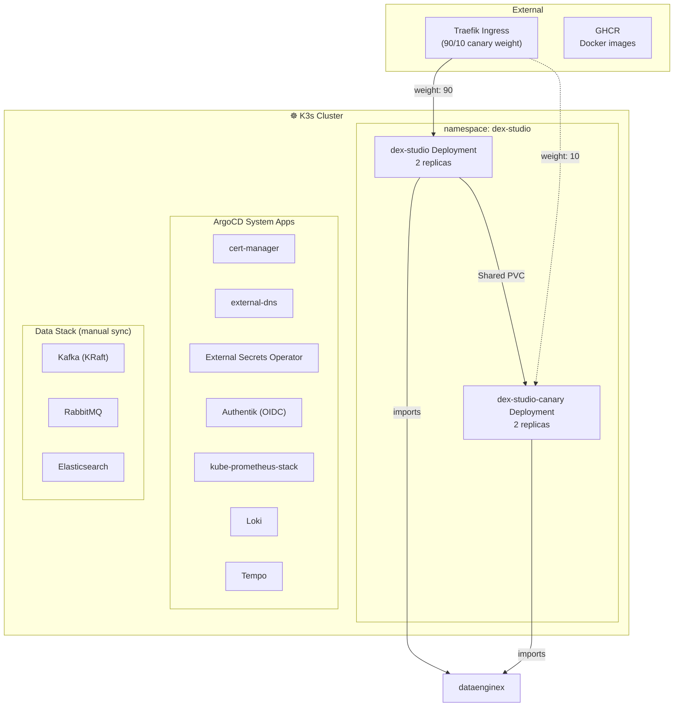

# DataEngineX Studio — Architecture

> **Single-page web UI for the DataEngineX library. FastAPI + Jinja2 + HTMX, zero microservices.**

---

## Philosophy

```
┌─────────────────────────────────────────────────────────────────────┐
│  DEX Studio = DataEngineX with a face.                              │
│                                                                     │
│  • One FastAPI process imports dataenginex directly — no HTTP hop  │
│  • Server-rendered HTML (Jinja2) + HTMX for interactivity          │
│  • No JS build step, no SPA complexity, no Webpack/Vite            │
│  • Local-first: `docker compose up` or `uv run poe dev`            │
│  • Everything in one process: pipelines, ML, AI, scheduling, logs  │
└─────────────────────────────────────────────────────────────────────┘
```

---

## System Overview



---

## Core Architecture

### 1. FastAPI Application Factory

```python
# src/dex_studio/app.py
def create_app() -> FastAPI:
    app = FastAPI(
        title="DEX Studio",
        lifespan=_lifespan,  # startup/shutdown hooks
    )
    _register_exception_handlers(app)
    _add_middlewares(app)
    app.include_router(root.router)
    app.include_router(data.router, prefix="/data")
    app.include_router(intelligence.router, prefix="/intelligence")
    app.include_router(secops.router, prefix="/secops")
    app.include_router(system.router, prefix="/system")
    app.include_router(api.router, prefix="/api")
    app.mount("/metrics", make_asgi_app())  # Prometheus
    return app
```

**Middlewares (in order):**
1. `SessionMiddleware` — signed cookies, 30-day expiry
2. `_SelectiveGZip` — skips SSE/streaming endpoints
3. `_correlation_id` — X-Request-ID header + structlog contextvars
4. `_security_headers` — CSP, HSTS, frame options, permissions policy
5. `_timing` — Server-Timing header + slow request warnings (>1s)

### 2. DexEngine Singleton

```python
# src/dex_studio/_engine.py
_ENGINE: DexEngine | None = None
_ENGINE_LOCK = threading.Lock()

def get_engine() -> DexEngine | None:
    # Auto-initializes from:
    # 1. DEX_CONFIG_PATH env var
    # 2. Saved default (config.load_prefs().default_config_path)
    # 3. User projects (~/.dex-studio/projects/)
    # 4. Starter examples (examples/*/dex.yaml)
```

**Key design:**
- Thread-safe singleton with lock (prevents race on project switch)
- Closes previous engine before replacing (releases SQLite connections)
- Shared DuckDB connection pool for read-only queries
- Project discovery: `~/.dex-studio/projects/` + `examples/`

### 3. Router Domain Map

| Router | Prefix | Domain |
|--------|--------|--------|
| `root` | `/` | Landing, onboarding, project selector, auth |
| `data` | `/data` | Pipelines, sources, warehouse, SQL, lineage, quality |
| `intelligence` | `/intelligence` | ML models, experiments, drift, agents, playground |
| `secops` | `/secops` | PII scan, masking, audit log, policies, alerts |
| `system` | `/system` | Logs, scheduler, components, health, settings |
| `api` | `/api` | REST endpoints for external consumers |
| `content` | `/content` | Explorer (movie-dex example) |

### 4. Template Architecture

```
templates/
├── base.html              # Layout, nav, HTMX includes, Alpine.js stores
├── components/            # Reusable partials (cards, tables, modals, forms)
├── data/                  # Pipeline DAG, source browser, warehouse, SQL
├── intelligence/          # Model cards, experiment compare, agent chat
├── secops/                # PII scan results, masking config, audit timeline
├── system/                # Log viewer, scheduler, compaction, system info
└── content/               # Explorer (movie-dex specific)
```

**HTMX pattern:**
```html
<!-- Trigger partial update -->
<button hx-get="/data/pipelines/{{ name }}/run" hx-target="#run-result"
        hx-indicator="#spinner">Run</button>

<!-- SSE log tail -->
<div hx-ext="sse" sse-connect="/system/logs/stream" hx-swap="beforeend">
  <div id="log-entries"></div>
</div>
```

---

## Startup Sequence



**Startup details:**
1. `init_db()` — SQLite schema for Studio prefs, projects, auth
2. `setup_password()` — ensures auth.hash exists or creates default
3. `get_engine()` — pre-warms DexEngine (loads config, inits subsystems)
4. `start_scheduler()` — croniter-based pipeline/drift scheduler
5. `queue_processor_loop()` — background ARQ-style task processor

---

## Data Flow: Pipeline Run via UI



---

## Authentication & Session

```
┌─────────────────────────────────────────────────────────────────────┐
│  Session-based auth (no JWT, no OAuth in core)                      │
├─────────────────────────────────────────────────────────────────────┤
│  • SessionMiddleware: signed cookies, 30-day max_age               │
│  • DEX_STUDIO_SESSION_SECRET: env var (K8s required) or            │
│    auto-generated ~/.dex-studio/session.key                        │
│  • RequiresLogin / RequiresEngine exceptions → redirects           │
│  • OIDC (Authentik) wired via infradex, not in core                │
│                                                                     │
│  Flow:                                                              │
│  1. No password set → /setup (create admin)                        │
│  2. Password set → /login (form POST → session cookie)             │
│  3. Authenticated → RequiresEngine checks engine exists            │
│  4. No engine → /onboarding (project selector)                     │
└─────────────────────────────────────────────────────────────────────┘
```

---

## Observability Integration

| Component | Integration | Endpoint |
|-----------|-------------|----------|
| **Prometheus** | `prometheus_client.make_asgi_app()` | `/metrics` |
| **Health** | `engine.health()` via `/health` | `/health` |
| **Logs** | structlog → stdout + SSE `/system/logs/stream` | SSE |
| **Tracing** | OpenTelemetry SDK (optional) | Tempo |
| **Container metrics** | cAdvisor + OOM alerts | Prometheus |

**Metrics exposed:**
- `dex_studio_http_requests_total{method,path,status}`
- `dex_studio_http_request_duration_seconds` (histogram)
- `dex_studio_pipeline_runs_total{pipeline,status}`
- `dex_studio_engine_initialized` (gauge)
- `dex_studio_active_sessions` (gauge)

---

## Deployment Topologies

### Local (Docker Compose)

```
docker-compose.yml
├── dex-studio (FastAPI)
├── PostgreSQL (shared state)
├── Redis (sessions + ARQ)
├── Kafka + Schema Registry (streaming)
├── Elasticsearch (lexical search)
├── Prometheus + Alertmanager
├── Grafana (dashboards)
├── Tempo (traces)
├── Loki (logs)
└── cAdvisor (container metrics)
```

### Kubernetes (infradex + ArgoCD)



**Canary Deploy:**
- Separate `dex-studio-canary` deployment
- `TraefikService` CRD weights traffic 90/10 stable→canary
- ArgoCD ApplicationSet manages prod/stage overlays
- Promotion = update stable overlay image tag

---

## Project Structure

```
src/dex_studio/
├── app.py              # FastAPI factory, lifespan, middlewares
├── _engine.py          # DexEngine singleton + project discovery
├── config.py           # Projects registry + UI preferences
├── auth.py             # Session auth, password, OIDC hooks
├── logging_setup.py    # structlog config + uvicorn bridging
├── utils.py            # Template filters (fmt_ts, fmt_bytes, etc.)
├── _json.py            # orjson helpers
├── routers/
│   ├── _deps.py        # Shared FastAPI deps (engine, auth, render)
│   ├── root.py         # Landing, onboarding, project selector
│   ├── data.py         # Pipelines, sources, warehouse, SQL
│   ├── intelligence.py # ML models, experiments, agents
│   ├── secops.py       # PII, masking, audit, alerts
│   ├── system.py       # Logs, scheduler, components, health
│   ├── api.py          # REST endpoints
│   └── content.py      # Explorer (movie-dex example)
├── templates/          # Jinja2 HTML templates
├── static/             # CSS (design tokens), Alpine.js, HTMX
├── scheduler.py        # croniter pipeline/drift scheduler
├── jobs.py             # Background task executor (thread pool)
├── studio_db.py        # Studio prefs/projects/auth SQLite
├── pipeline_queue.py   # Pipeline run queue + status
├── pipeline_definition.py  # Pipeline CRUD + validation
├── execution.py        # Pipeline execution + progress callbacks
├── watermark.py        # Ingestion watermark + hash dedup
├── compaction.py       # Parquet file compaction
├── backfill.py         # Pipeline backfill engine
├── quality_eval.py     # Quality gate evaluation
├── schema_evolution.py # Schema change detection
├── embeddings.py       # Embedding generation for RAG
├── flow.py             # Pipeline flow canvas (DAG viz)
├── notify.py           # Notification webhooks
├── cli.py              # `dex-studio` CLI entry point
└── oidc.py             # Authentik OIDC integration
```

---

## Design Decisions

| Decision | Rationale |
|----------|-----------|
| **Server-rendered HTML (Jinja2)** | No JS build step, works without JS, SEO-friendly, fast initial paint |
| **HTMX + Alpine.js** | Progressive enhancement, partial updates, no SPA complexity |
| **FastAPI + direct import** | Same process as dataenginex, no HTTP hop, shared memory |
| **SQLite for Studio prefs** | Zero-config, portable, survives restarts |
| **Thread-safe engine singleton** | Single process, multiple requests, project switching |
| **SSE for live logs** | Native browser support, no WebSocket complexity |
| **Design tokens (CSS variables)** | Consistent theming, no Tailwind/PostCSS build |
| **Prometheus `/metrics` mount** | Native metrics, no sidecar needed |
| **Memory limit 4Gi** | 12.6M-row pipeline OOMed at 2Gi (exit 137) |

---

## Version Compatibility

| DEX Studio | dataenginex | Python | FastAPI |
|------------|-------------|--------|---------|
| 0.5.x | 0.5.x | 3.13+ | 0.139+ |

**Policy:** Lockstep with dataenginex minor versions.

---

## Related Docs

| Doc | Description |
|-----|-------------|
| [README](../README.md) | Quick start, screenshots, ecosystem |
| [Getting Started](getting-started.md) | First project, pipeline, agent |
| [Configuration](configuration.md) | Projects, preferences, settings |
| [Observability](observability.md) | Metrics, logs, traces, alerts |
| [Design](design.md) | UI/UX design system, components |
| [Architecture Review](architecture-review.md) | Production readiness rubric |

---

*Architecture version: 0.5.x | Updated: 2026-07-20*