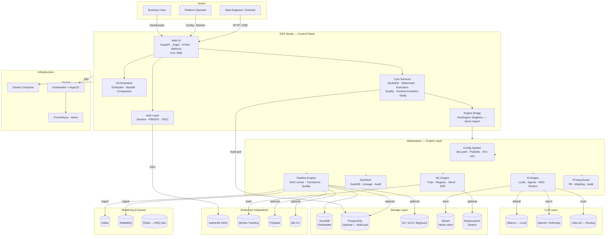
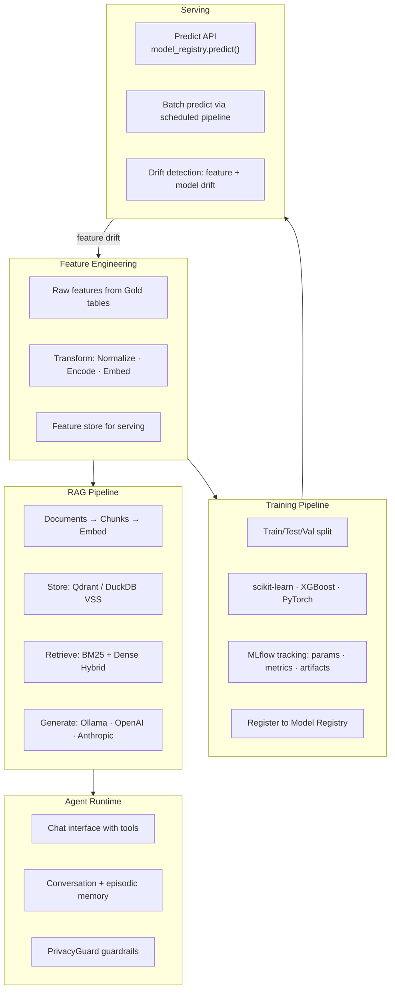
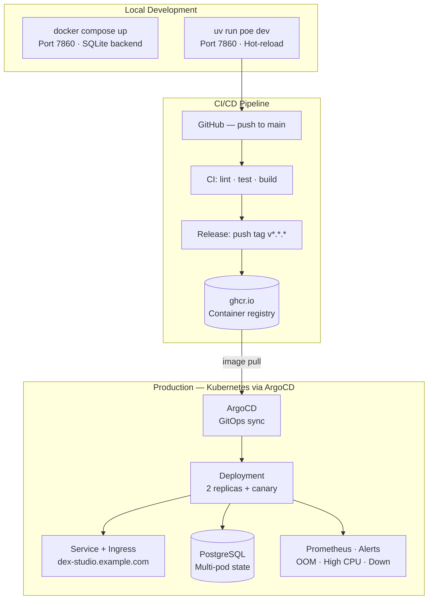

# DEX Studio — Design Document

## 1. Purpose

DEX Studio is a **local, Python-first, open-source web UI** that provides a single
control plane for end-to-end data projects powered by [TheDataEngineX/dataenginex](https://github.com/TheDataEngineX/dataenginex).

It does **not** fork or rebrand upstream DEX. It imports `dataenginex` directly as a library
and unifies all workflows in one place:

```text
Project Setup → Ingestion → Medallion Pipelines → ML/AI → Observability
```

## 2. Architecture



Studio mounts `dataenginex` via `DexEngine` (see `src/dex_studio/_engine.py`). No separate server process is required — the engine is imported directly into the same process. Pipeline DAG resolution lives in `dataenginex.data.pipeline.dag`.

### Why FastAPI + Jinja2 + HTMX

| Requirement | Approach |
| --- | --- |
| Server-side rendering (fast initial load) | Jinja2 templates |
| Partial page updates without a JS build step | HTMX attributes |
| Type-safe route handlers | FastAPI + Pydantic |
| Direct library access (no HTTP hop) | `dataenginex` imported in-process |
| Standard Python tooling | pytest TestClient, mypy strict |

## 3. Project Structure

```text
dex-studio/
├── pyproject.toml                  # Hatchling build, deps, poe tasks
├── src/
│   └── dex_studio/
│       ├── __init__.py             # Package + version
│       ├── app.py                  # FastAPI factory — mounts routers, templates, static
│       ├── cli.py                  # CLI entry (dex-studio --host --port)
│       ├── config.py               # StudioPrefs + ProjectEntry (projects.yaml, prefs.yaml)
│       ├── auth.py                 # Session-based auth (PBKDF2 + rate limiter)
│       ├── oidc.py                 # Authentik OIDC auth support
│       ├── _engine.py              # DexEngine singleton (get_engine / set_engine)
│       ├── _json.py                # orjson-backed JSON helpers
│       ├── utils.py                # Shared template helpers
│       ├── nav.py                  # Sidebar nav structure
│       ├── flow.py                 # Pipeline DAG utilities for the UI
│       ├── studio_db.py            # Dual-backend persistence (SQLite/PostgreSQL)
│       ├── scheduler.py            # Async cron scheduler
│       ├── jobs.py                 # Background task lifecycle
│       ├── watermark.py            # Ingestion watermark + hash dedup
│       ├── backfill.py             # Pipeline backfill engine
│       ├── compaction.py           # Parquet file compaction
│       ├── execution.py            # Pipeline execution tracking
│       ├── embeddings.py           # Embedding management UI
│       ├── quality_eval.py         # Data quality evaluation
│       ├── run_checks.py           # Run quality checks
│       ├── schema_evolution.py     # Schema evolution management
│       ├── notify.py               # Event notification dispatch
│       ├── store.py                # Store abstraction
│       ├── db_store.py             # DB store helpers
│       ├── logging_setup.py        # Structlog configuration
│       ├── logstore.py             # In-app log capture + storage
│       ├── routers/
│       │   ├── __init__.py
│       │   ├── root.py             # Home, project selector, health
│       │   ├── data.py             # Data domain routes
│       │   ├── intelligence.py     # Intelligence domain routes
│       │   ├── secops.py           # SecOps domain routes
│       │   ├── system.py           # System domain routes
│       │   ├── content.py          # Content domain routes
│       │   ├── api.py              # API routes
│       │   └── _deps.py            # Shared FastAPI deps (engine, auth, render)
│       ├── templates/
│       │   ├── base.html           # Layout shell (sidebar, nav)
│       │   ├── components/         # Macros and shared components
│       │   ├── data/               # Data domain templates
│       │   ├── intelligence/       # Intelligence domain templates
│       │   ├── secops/             # SecOps domain templates
│       │   ├── system/             # System domain templates
│       │   ├── content/            # Content domain templates
│       │   └── partials/           # HTMX fragments
│       └── static/
│           └── studio.css          # Styles
├── scripts/
│   ├── demo/
│   │   ├── browser_segments.py     # Playwright screenshot capture
│   │   └── record.py               # Playwright video recording
│   └── seed_moviedex.py            # Demo data seeding
├── tests/
│   ├── conftest.py
│   ├── unit/
│   ├── integration/
│   ├── system/
│   ├── security/
│   ├── performance/
│   └── regression/
└── docs/
    └── design.md                   # This document
```

## 4. Configuration

```yaml
# ~/.dex-studio/projects.yaml  — registered projects
projects:
  - name: my-project
    path: /home/user/workspace/my-project/dex.yaml
```

```yaml
# ~/.dex-studio/prefs.yaml  — UI preferences
theme: dark
last_project: my-project
```

Key environment variables:

| Variable | Default | Purpose |
| --- | --- | --- |
| `DEX_STUDIO_HOST` | `0.0.0.0` | Bind address |
| `DEX_STUDIO_PORT` | `7860` | Port |
| `DEX_STUDIO_SESSION_SECRET` | auto-generated | Cookie signing key |

## 5. Development Model

Each Studio page calls `DexEngine` methods directly. When Studio needs data that
`dataenginex` doesn't expose yet, the library must be extended first.

| Studio Domain | DexEngine Methods Used |
| --- | --- |
| Data | `run_pipeline`, `source_schema`, `source_sample`, `warehouse_layers`, `warehouse_tables`, `quality_checks` |
| Intelligence | `model_registry.list_models`, `model_registry.predict`, `agents[name].chat`, `drift_detector`, `embedding_search` |
| Content | content-feed, recommendation-compare, watch-provider, cross-source match |
| System | `health`, `config`, `store.list_pipeline_runs` |

### Rule

> **No Studio page without a DexEngine method. No DexEngine method without a Studio page.**

### ML + AI Architecture



## 6. Technology Choices

| Choice | Rationale |
| --- | --- |
| **FastAPI** | Standard ASGI, type-safe, TestClient for unit tests |
| **Jinja2** | Server-side rendering, no JS build pipeline |
| **HTMX** | Partial updates via HTTP attributes — minimal JS footprint |
| **dataenginex (direct import)** | No HTTP overhead; single process for local use |
| **DuckDB (via DexStore)** | Embedded persistence — zero ops |
| **Separate repo** | Different release cadence, users, and dependency trees |

## 7. Deployment



DEX Studio ships as a Docker image (`ghcr.io/thedataenginex/dex-studio`) deployed on Kubernetes via ArgoCD from [TheDataEngineX/infradex](https://github.com/TheDataEngineX/infradex). Run locally with `docker compose up`.

### Quality Attributes

| Attribute | How It's Achieved |
|-----------|-------------------|
| **Availability** | Multi-pod deployment (2 replicas), canary deploys, health checks |
| **Scalability** | Stateless app pods, PostgreSQL-backed state for multi-pod, async worker pool |
| **Security** | Session auth, CSRF tokens, security headers, PII guardrails, SQL sandbox, vulnerability scanning |
| **Maintainability** | Direct import (no microservices), modular router structure, ABC + Registry pattern |
| **Observability** | Structured logging, Prometheus metrics, OpenTelemetry tracing, in-app log viewer |
| **Data Locality** | Local-first — DuckDB embedded, Ollama default, data stays on-device |
| **Resilience** | Pipeline retry + dead letter, scheduler leader election, graceful fallbacks on external deps |
| **Testability** | pytest TestClient, mypy strict, integration/system/security test suites |

## 8. Roadmap

### Phase 0 — Foundation ✅

- Version 0.5.2 — all phases delivered

- FastAPI app factory + router scaffold

- DexEngine singleton integration

- Session auth + config system

- CI pipeline

### Phase 1 — Data & ML ✅

- Data domain: sources, pipelines, warehouse, quality, lineage
- ML domain: models, experiments, predictions, drift
- AI domain: agents, playground
- System domain: status, logs, metrics, components

### Phase 2 — Interactivity ✅

- HTMX-driven partial updates (live pipeline status, metric charts)
- Pipeline run trigger UI
- Model promotion workflow

### Phase 3 — Multi-Project ✅

- Project switcher
- Config editor
- Multi-instance support (PostgreSQL backend, dual-replica ArgoCD)

## 9. Screenshots

| Domain | Preview |
| --- | --- |
| Hub |  |
| Data — Pipelines |  |
| Data — Sources |  |
| Data — SQL Console |  |
| Data — Quality |  |
| Data — Lineage |  |
| Intelligence — Playground |  |
| Intelligence — Models |  |
| Intelligence — Agents |  |
| Intelligence — Traces |  |
| SecOps — Overview |  |
| System — Status |  |
| System — Logs |  |
| System — Scheduler |  |
| System — Runs |  |

## 10. Non-Goals

- **Cloud deployment** — Studio is local-first; no hosted SaaS version
- **Multi-user auth** — single-user or small-team use
- **Data editing** — read-only; mutations are pipeline triggers only
- **Replacing Grafana** — Studio shows DEX-specific views, not generic metric dashboards
