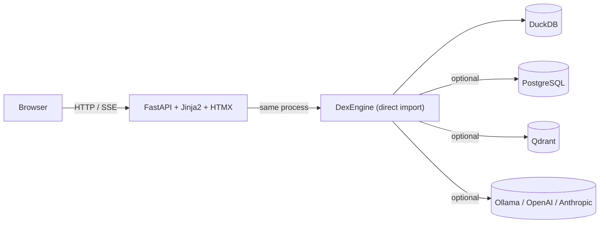

# DEX Studio

**Open-source, self-hosted, local-first Data + ML + AI workbench.** Single-page web UI — no separate API server, no microservices.


## Features

- **Data** — Sources (CSV, Parquet, Postgres, Spark, dbt), Pipelines, SQL console, Warehouse (bronze/silver/gold), Lineage graph, Quality checks, Catalog, Transforms, Streaming, Schema, Backfill, Compaction
- **Intelligence** — Playground (SSE streaming chat), Models, Experiments, Dashboard, Agents, Traces, Drift, Embeddings, Features, Predictions, Tools, Finetune
- **SecOps** — PrivacyGuard overview, PII strategy config, Audit log, Alert rules, Policies
- **System** — Status, Live log tail (SSE), Metrics, Runs feed, Scheduler, Compaction, Alerting, Costs, Components

## Quick Start

```bash
git clone https://github.com/TheDataEngineX/dex-studio
cd dex-studio
docker compose up
# open http://localhost:7860
```

Or natively:

```bash
uv sync
uv run poe dev
```

## Documentation

| Guide | Description |
|-------|-------------|
| [Getting Started](getting-started.md) | Install, run, create your first project and pipeline |
| [Configuration](configuration.md) | All `dex.yaml` options — sources, pipelines, ML, AI, backends |
| [Design](design.md) | Architecture decisions, project structure, roadmap |
| [Architecture Review](architecture-review.md) | Request flow, auth, scheduler, deployment |
| [Observability](observability.md) | Metrics, logging, tracing, Prometheus integration |

## Development

```bash
uv run poe lint              # ruff lint
uv run poe lint-fix          # ruff lint + auto-fix
uv run poe typecheck         # mypy strict
uv run poe test              # pytest
uv run poe check-all         # lint + typecheck + test
uv run poe dev               # uvicorn dev server (port 7860, hot-reload)
```

## Architecture



No external API server — dex-studio imports `dataenginex` directly as a Python library. A single process handles HTTP, rendering, and engine execution.

## Ecosystem

| Repo | Purpose |
|------|---------|
| [dataenginex](https://github.com/TheDataEngineX/dataenginex) | Python library — engine, config, all backends |
| [dex-studio](https://github.com/TheDataEngineX/dex-studio) | This repo — web UI |
| [infradex](https://github.com/TheDataEngineX/infradex) | Kubernetes deployment via ArgoCD |

## Links

- [GitHub](https://github.com/TheDataEngineX/dex-studio)
- [Docs](https://docs.thedataenginex.org)
- [Website](https://thedataenginex.org)

---

**License:** MIT • **Python:** 3.13+ • **Port:** 7860 • **Status:** Pre-1.0