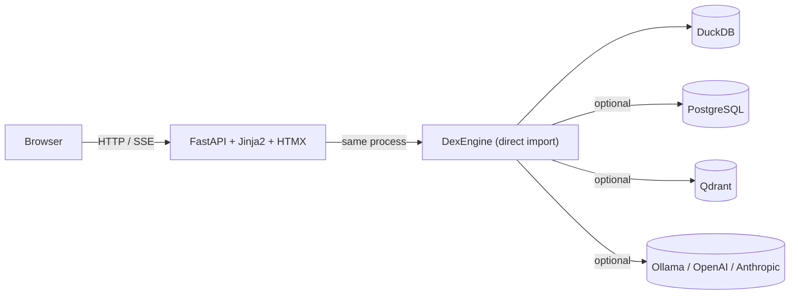

# DEX Studio Documentation v0.5.2

Open-source, self-hosted, local-first Data + ML + AI web UI. Built on FastAPI + Jinja2 + HTMX.

## Quick Start

```bash
git clone https://github.com/TheDataEngineX/dex-studio && cd dex-studio
docker compose up
```

Then open http://localhost:7860.

## Features

- **Data:** Sources, pipelines, warehouse, lineage, quality, catalog, transforms, streaming, schema, backfill, compaction
- **Intelligence:** Playground, models, experiments, agents, traces, drift, embeddings, features, predictions, tools, finetune
- **SecOps:** Privacy, audit, alerts, policies, PII scanning
- **System:** Status, logs, metrics, runs, scheduler, alerting, costs, components, settings

## Architecture



No external API server — dex-studio imports `dataenginex` directly as a Python library. A single process handles HTTP, rendering, and engine execution.

## Links

- [GitHub](https://github.com/TheDataEngineX/dex-studio)
- [Docs](https://docs.thedataenginex.org)
